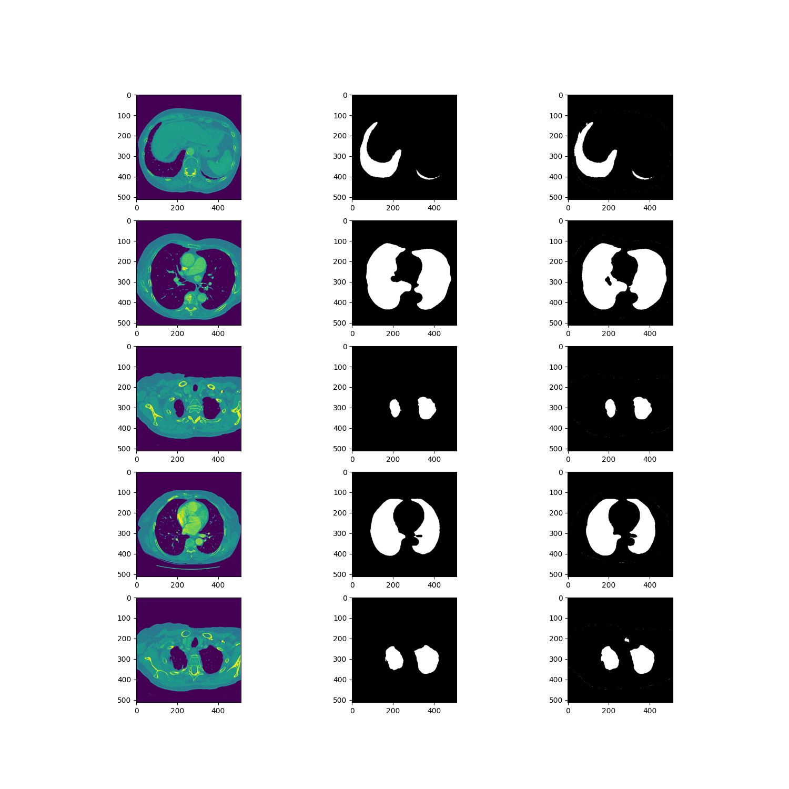
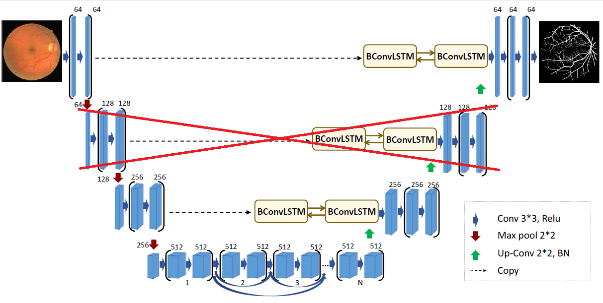
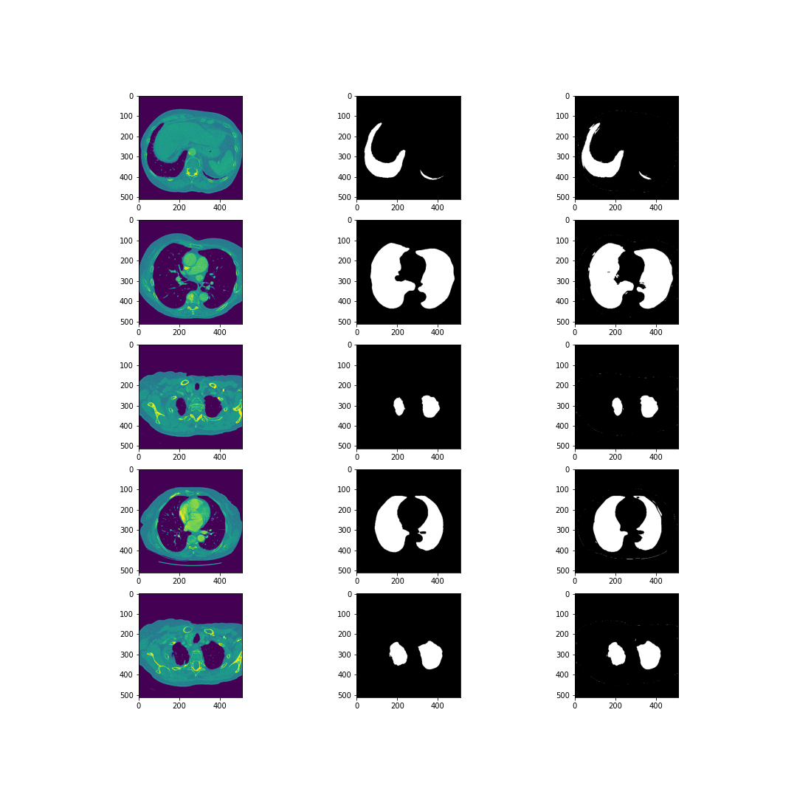
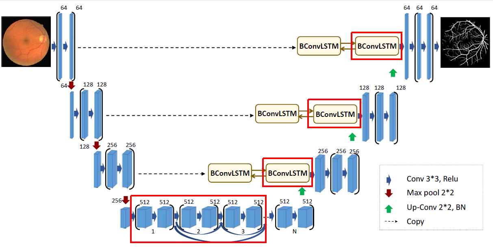
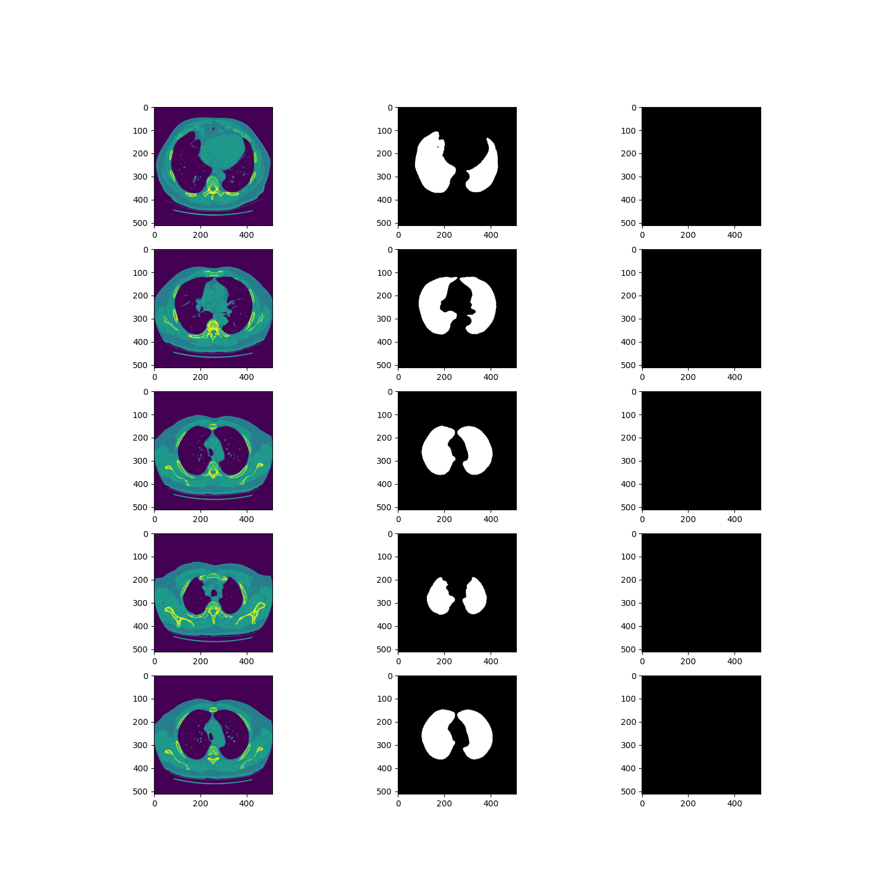
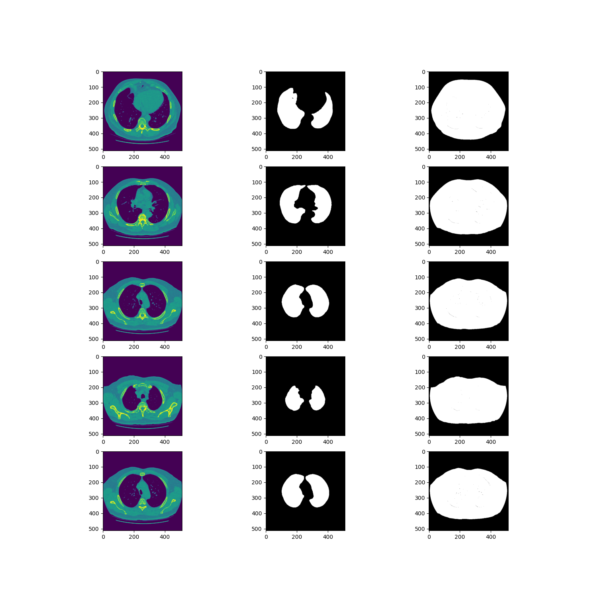
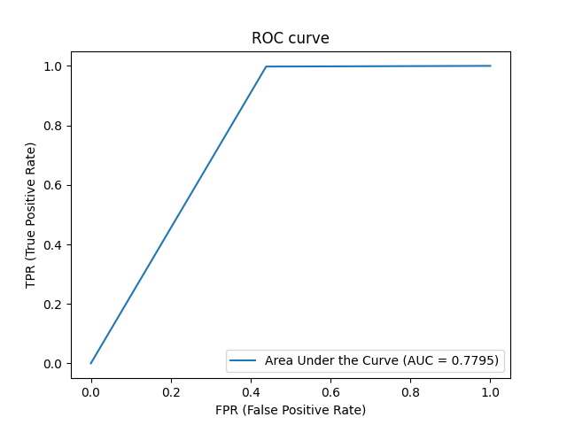

# Praca domowa nr 2 - Architektura sieci neuronowych
Celem pracy domowej nr 2 jest modyfikacja architektury sieci neuronowej `BCDU-Net`, używanej do tworzenia masek na podstawie obrazów tomografii komputerowej. W wyniku zmian powstały trzy nowe architektury, proponowane przez każdego z członków zespołu.

Celem przypomnienia, tak wygląda architektura proponowana przez autorów projektu `BCDU-Net` [(Azad et al., 2020)](https://github.com/rezazad68/BCDU-Net):

## Marysia Kałuska
W ramach moich modyfikacji sieci  zaproponowanej przez twórców artykułu postanowiłam wprowadzić kilka zmian:
- Zmiana funkcji aktywacji z `relu` na `tanh` - `tanh` przyjmuje wartości od -1 do 1, co oznacza, że nie ucina części ujemnej, chciałam sprawdzić czy uwzględnienie ujemnych wartości zamiast ich pominięcia poprawi skuteczność modelu;
- Z powodów wydajnościowych `batch_size` ustawiłam na 1 – przy 2 ze względu brak pamięci uczenie kończyło się błędem;
- Zmiany architektuktury sieci - zduplikowałam warstwę `Conv2D` tak jak na rysunku, kierując się przesłanką, że więcej warstw może oznaczać większą skuteczność modelu.
Model został wytrenowany w 50 epokach tak jak model z artykułu.
Poniżej zamieszczam diagram prezentujący zmiany w architekturze sieci.

### Wyniki
Wyniki osiągnięte przez zmodifikowaną sieć były gorsze od sieci oryginalnej. 
Wprowadzone zmiany nie wpłynęły drastycznie na pogorszenie sieci możliwe, że gdyby można było wytrenować
tę sieć przy ustawieniach `batch_size=2` wyniki byłyby bardziej zbliżone.
Poniżej zamieszczam porównanie.

| Metryki: | Accuracy |  AUC ROC | F1 Score | Specificity | Sensitivity | Jaccard similarity score|
| ------- | --------- | ------ | ----- | --- | --- | --- |
| BCDU-Net | 0.9972 | 0.9946 | 0.9904 | 0.9982 | 0.9910 | 0.9972 |
|  Po zmianach| 0.9947 | 0.9928 | 0.9861 | 0.9958 | 0.9898 | 0.9947|

Predykcje zmienionego modelu znajdują się w prawej kolumnie. Widzimy, że choć jego skuteczność jest wysoka, niedokładność tego modelu jest widoczna dla ludzkiego oka . Możemy zauważyć, że model lekko przeszacowuje powierzchnię płuc.

## Mikołaj Spytek

### Dokonane zmiany

W mojej modyfikacji spróbowałem "odchudzić" sieć neuronową poprzez usunięcie niektórych warstw. Moją główną motywacją było przeczucie i chęć zobaczenia, co się stanie po takich zmianach. Skoro oryginalny, bardzo rozbudowany model osiągał świetne wyniki (Accuracy na poziomie 0.9972), to być może uda się wytrenować podobny model, tylko w krótszym czasie, a spadek dokładności będzie niewielki i taki tradeoff będzie korzystny. Dokonałem więc następujących zmian:
- zmieniłem wymiar outputu pierwszej warstwy maxpoolingu, tak, aby pasowała do następnego wejścia i podpiąłem ją bezpośrednio tam, 
- odłączyłem od sieci jeden z modułów `Long Short Term Memory`,
- zmieniłem rozmiar wyjściowy drugiej warstwy upsamplingowej, aby dało się ją przypiąć o poziom wyżej. 

Sieć po modyfikacji przedstawia poniższy diagram:

### Wyniki

Wyniki działania tego modelu zupełnie mnie zaskoczyły. Przede wszystkim, nie stało się to, czego oczekiwałem. Model z mniejszą ilością warstw uczył się dużo dłużej. Podczas, gdy model z artykułu osiągnął accuracy >0.99 już po ok. 5 epokach, model po moich zmianach osiągnął taki poziom, dopiero po wykonaniu pełnych 20 epok, które założyłem jako maksimum. Jednak model nie był dużo gorszy, niż ten z artykułu. Porównanie najważniejszych metryk przedstawia tabelka:

| Metryki: | Accuracy |  AUC ROC | F1 Score | Specificity | Sensitivity | Jaccard similarity score|
| ------- | --------- | ------ | ----- | --- | --- | --- |
| BCDU-Net | 0.9972 | 0.9946 | 0.9904 | 0.9982 | 0.9910 | 0.9972 |
|  Po zmianach| 0.9929 | 0.9892 | 0.9817 | 0.9953 | 0.9830 | 0.9641|

Widzimy, że we wszystkich miarach większe wartości osiąga model oryginalny. Jednak zmodyfikowany również jest dużo lepszy od losowości.

Niestety za gorsze wyniki nie uzyskaliśmy żadnej rekompensaty - model nie uczy się szybciej, więc nie ma sensu stosowanie go, lepiej stosować model oryginalny. Różnica czasu trenowania na moim sprzęcie to ok. 1,5 h dla modelu oryginalnego i ok. 6 dla modelu z modyfikacjami.

Przykładowe wyniki działania modelu po modyfikacji przedstawia rysunek. Co ciekawe - widzimy, że maski w tym modelu są bardziej rozmyte i niewyraźne:

## Paweł Koźmiński
### Motywacja pierwszej próby
Podjęta w moim wykonaniu pierwsza próba modyfikacji architektury sieci neuronowej `BCDU-Net` motywowana była własnymi intuicjami na podstawie zaproponowanego rozwiązania przez autorów projektu oraz obserwacji z tytułu uczestnictwa w zajęciach z przedmiotu Metody Inteligencji Obliczeniowej. Wprowadziłem szereg prób, jednak jak się okazało, nie były one skuteczne:
 - po pierwsze, zmiana metody inicjalizacji parametrów z metody `he_normal` na `glorot_uniform` - zwanej również metodą Xavier, która w moim odczuciu pozwala osiągać równie wysokie, o ile nie wyższe, wyniki modeli,
 - dodałem kolejną, czwartą warstwę połączeń gęstych na dole sieci - jest to moim zdaniem newralgiczny moment całej architektury, wyróżniający to rozwiązanie spośród innych, więc rozwinięcie go potencjalnie mogło przynieść jeszcze wyższe rezultaty,
 - zmodyfikowałem funkcję aktywacji warstwy wyjściowej z `sigmoid` na `softmax`, znaną jako skuteczną w zadaniach klasyfikacji,
 - zmieniłem kernel_size sieci `BConvLSTM` z `(3,3)` na `(2,2)` - być może mniejszy rozmiar jądra oznaczałby dokładniejsze wykonywanie operacji.

Główne zmiany zaznaczone na architekturze sieci prezentują się następująco:

### Wynik pierwszej próby
Niestety pierwsza próba modyfikacji architektury przyniosła efekt odwrotny od oczekiwanego. Model zupełnie nie nauczył się tworzenia masek, zwracał obrazy w całości pomalowane na czarno. Przypisanie każdemu pikselowi wartości 0, przyniosło wprawdzie wartość miary accuracy na poziomie 85%, jest to jednak doskonały przykład na wadę tej funkcji - wartość specifity wyniosła 0, a AUC 0.5. 
Czas działania jednej epoki zmodyfikowanej sieci spadł o około 10%.

Przykład zwróconych przez sieć wyników:

### Motywacja drugiej próby
Po porażce poniesionej przez pierwszą wersję zmodyfikowanej architektury, zdecydoawłem się zajrzeć do literatury - badań naukowych zajmujących się podobnym problemem. Autorzy projektu `BCDU-Net` sami wskazują kilka analogicznych projektów - między innymi [(Ronneberger and etc. all, 2015)](https://arxiv.org/abs/1505.04597). Korzystając z proponowanej formy w powyższym artykule zdecydowałem się na:
 - usunięcie jednej z warstw połączeń gęstych na najniższym z poziomów,
 - zmiana rozmiaru niektórych warstw poprzez dwukrotne ich zwiększenie - zgodnie z wersją proponowanym w cytowanym artykule oraz
 - pozostawienie metody inicjalizacji Xaviera - tym razem jednak `glorot_normal`.`
Funkcja aktywacji ostatniej z warstw pozostała niezmieniona - `sigmoid`. 

Miejsca zmian zostały zaznaczone na poniższej ilustracji:

### Wynik drugiej próby

Proponowana druga wersja modyfikacji architektura sieci przyniosła wyższe wyniki od pierwszej. Wartość AUC na poziomie 0.78, czułość bliska 1 oraz swoistość 0.56 również nie są najgorsze. Analizując jednak uzyskane maski, szybko można zauważyć jednak, że sieć nie zwracam poprawnych wyników. Odpowiednio określany jest rozmiar przekroju ciała, którego obraz tomografii został wykonany, jednak z wnętrze płuc pozyskiwane są wyłącznie nieliczne punkty. Czas trenowania nowej sieci wzrósł w porównaniu z pierwotną o około 9%.

Przykłady estymowanych masek oraz wykres ROC proponowanej architektury:

### Wnioski
Uzyskane przez proponowane zmodyfikowane architektury sieci są znacząco niższe od tych prezentowanych przez twórców artykułu. Niestety trudno było rywalizować z rozwiązaniem, które osiągnęło wartość AUC równą 0.9946. Uzyskane estymacje masek są jednak niskiej jakości i raczej nie mogłyby być użyte w praktycznych zastosowaniach.

## Podsumowanie

Okazało się, że żaden z uzyskanych przez nas modeli nie osiągnął lepszych wyników, niż ten opracowany przez autorów artykułu. Mogliśmy się jednak tego spodziewać, gdyż mają oni dużo większą wiedzę specjalistyczną oraz dużo więcej czasu na trenowanie modeli i wybieranie najlepszych hiperparametrów metodą prób i błędów. Ćwiczenie to jednak pozwoliło nam zdobyć choć minimalne doświaczenie przy pracy z sieciami neronowymi. Wiemy już, co na pewno nie będzie działać oraz mogliśmy zaobserwować jak niektóre hiperparametry wpływają na model (np. zmiana funkcji aktywacji). Dodatkowo przy wprowadzaniu modyfikacji poznaliśmy część składni bilioteki keras.
