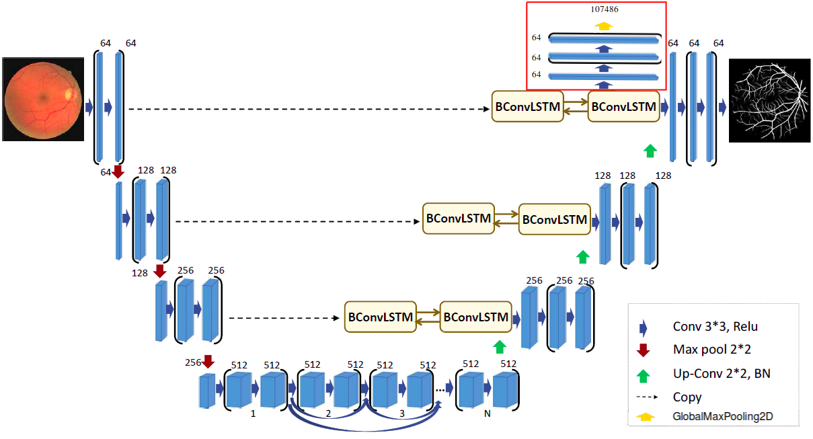

# Rozwój modelu poprzez dodanie augmentacji danych oraz transfer learningu

## 1. Augmentacja danych

_Zaugmentuj dane przy pomocy Generative Adversarial Network (GAN). Podejścia dowolne. Można zaimplementować samemu. Można poszukać, czy jest może jakaś odpowiednia w Internecie._

### 1.1 Przegląd literatury
#### 1.1.1 [Data augmentation using generative adversarial networks (CycleGAN) to improve generalizability in CT segmentation tasks](https://www.nature.com/articles/s41598-019-52737-x) (V. Sandfort, K. Yan, P. Pickhardt & R. Summers, 2019)

Autorzy artykułu badają jak sztucznie wygenerowane dane przy pomocy CycleGAN wpływają na wyniki segmentacji trenowanej sieci. Transformacja przeprowadzana przez CycleGAN polegała na obniżeniu kontrastu zdjęcia CT. Trenowanie sieci zostało przeprowadzone na zbiorze oryginalnym, a także na zbiorze będącym połączeniem zbioru oryginalnego ze zbiorem syntetycznym składającym się ze zdjęć o obniżonym kontraście. Wyniki sieci zostały również porównane z wynikami sieci trenowanej na powiększanych zbiorach danych z użyciem takich metod jak standard augmentation oraz histogram equalization augmentation. Okzało się, że CycleGAN w wielu przypadkach w zależności od organu wewnętrznego sprawuje się najlepiej.

#### 1.1.2 [Unpaired Image-to-Image Translationusing Cycle-Consistent Adversarial Networks](https://arxiv.org/pdf/1703.10593.pdf) (J. Zhu, T. Park, P. Isola, A. Efros, 2017) 

Powyższy artykuł opublikowany w 2017 r. prezentuje rozwiązanie CycleGAN. Jest w nim zawarte wyjaśnienie jak działa CycleGAN. Kod napisany przez autorów został napisany pod bibliotekę PyTorch, jednak jest dużo powszechnie dostępnych implementacji CycleGAN dostosowanych do biblioteki Tensorflow.
Na oficjalnej stronie Tensorflow dostępny jest tutorial wprowadzający do korzystania z CycleGAN w ramach dogłębnego zrozumienia jego działania strona odsyła nas do wyżej wymienionego artykułu. (https://www.tensorflow.org/tutorials/generative/cyclegan)

#### 1.1.3 Podsumowanie

Augmentacja zdjęć CT klatki piersiowej została już częściowo zgłębiona. W pierwszej z przytoczonych przeze mnie prac autorzy wykorzystują powiększony zbiór danych do segmentacji nerek, wątroby oraz śledziony. Moim celem będzie sprawdzenie czy zastosowana metoda obniżania kontrastu zdjęć i mieszania ich ze zdjęciami oryginalnymi pomoże osiągnąć dokładniejsze wyniki dla segmentacji płuc w sieci BCDU. 
Narzędziem którego zamierzam użyć do augmentacji zbioru zdjęć będzie CycleGAN.

### 1.2 Pomysł i implementacja

Ze względu na istotność masek da zdjęć w problemie segmentacji, postanowiliśmy wygenerować zdjęcia do uczenia nienadzorowanego, które mogą zostać wykorzystane w pretrainingu. Oznacza, to że zdjęcia były generowane bez masek. 
Wcześniejsze próby generowania zdjęć z maskami niestety wpływały negatywnie na uczenie modelu, ze względu na to, że sztucznie wygenerowane maski do zdjęć nie pokrywały się w 100% z tym jak powinna wyglądać prawdziwa maska. Uczenie na takich danych wprowadzało model w błąd. 

#### 1.2.1 CycleGAN

Po dokładnym zgłebieniu tematu, okazało się, że aby wykonać taki generator należy posiadać zdjęcia kontrastowe i niekontrastowe. Niestety wszystkie nasze zdjęcia są w jednym kontraście. Dlatego drugi zbiór zdjęć został sztucznie dorobiony poprzez zastosowanie na zbiorze treningowym wyrównania histogramu. W ten sposób otrzymaliśmy dwa zbiory danych: zbiór oryginalny i zbiór ze zmienionym kontrastem. Następnie ze zdjęć ze zmienionym kontrastem przy pomocy [CycleGANa](https://github.com/LynnHo/CycleGAN-Tensorflow-2) próbowaliśmy odzyskać zdjęcia sprzed transformacji. Wygenerowane w ten sposób zdjęcia zostały poddane post processingowi - obszar płuc był modyfikowany przy użyciu metody dilate na całym zdjęciu, a rozmiar kernela był wybierany losowo z wartości {1, 3, 5, 7}. Takie przetworzenie danych powodowało zmniejszenie obszaru płuc na zdjęciach.

#### 1.2.2 Próba generowania zdjęć z maskami

W tej próbie inspiracją był artykuł [Generative Adversarial Network based Synthesis for Supervised Medical Image Segmentation](https://www.researchgate.net/publication/317014710_Generative_Adversarial_Network_based_Synthesis_for_Supervised_Medical_Image_Segmentation). Proponowane przez autorów podejście zakładało, że generator równocześnie będzie wytwarzał zdjęcia płuc oraz odpowiadające im maski, a dyksryminator wygenerowaną parę zdjęć płuca + maska porówna z prawdziwą parą zdjęć.
Niestety tak skonstruowany GAN wymaga bardzo długiego trenowania w celu osiągnięcia zadowalających efektów, z tego powodu napotkaliśmy ograniczenia sprzętowe. 

## 2. Transfer learning - auxiliary task

_Wymyśl dodatkowe zadanie (auxiliary task), które będzie dobrze nadawało się do Twojego problemu. Wykonaj uczenie wstępne za pomocą dodatkowego zadania._

### 2.1 Przegląd literatury
W ramach przygotowań do zaaplikowania dodatkowego zadania do modelu sieci neuronowej rozwiązującej zadanie segmentacji obrazów tomografii komputerowej płuc, dokonałem przeglądu istniejącej literatury naukowej, w celu poszukiwania wiedzy i inspiracji w jaki sposób najlepiej podejść do zagadnienia. Poniżej znajduje się kilka pozycji, które mogą się okazać pomocne w tym przypadku.

#### 2.1.1 [Multitask learning: teach your AI more to make it better](https://towardsdatascience.com/multitask-learning-teach-your-ai-more-to-make-it-better-dde116c2cd40) (Honchar A., 2018)

Artykuł został opublikowany na znanym i cenionym portalu towardsdatascience.com. Prezentuje uzasadnienie użycia dodatkowego zadania w procesie rozwoju modelu sieci neuronowej korzystając z różnych intuicji oraz przedstawia kilka praktycznych przypadków użycia techniki wraz z załączonym kodem napisanym w Pythonie z pomocą biblioteki Keras. Czytelnik ma okazje niemal namacalnie zauważyć jakie korzyści mogą płynąć z użycia dodatkowego zadania. Autor podkreśla, że technika może być uzyta praktycznie w przypadku każdego modelu sieci neuronowej wyliczając rozmaite pomysły jak osiągnąć lepsze wyniki na przykład rozpoznawania emocji na podstawie zdjęć twarzy czy przewidywania przyszłych indeksów giełdowych. Dla ciekawych historii i inspiracji pomysłu podany jest także krótki rys historyczny.

#### 2.1.2 [An Overview of Multi-Task Learning in Deep Neural Networks](https://arxiv.org/pdf/1706.05098.pdf) (Ruder S., 2017)

Opublikowana w 2017r. praca badacza z uniwersytetu w Dublinie stanowi przekrój ówcześnie używanych metod multitasku w modelach uczenia maszynowego. Artykuł składa się z wstępu - motywacji używania techniki, rozróżnienia dwóch wariantów: "Hard parameter sharing" oraz "Soft parameter sharing", wyjaśnienia skuteczności techniki, przykładu użycia w płytkich oraz głębokich modelach oraz propozycje dodatkowych zadań i konkluzje. Wśród nowych propozycji używania MTL (Multi-Task Learning) w sieciach neuronowych można wyróżnić m.in.:
* Głęboko powiązane sieci - dotrenowanie niektórych ostatnich warstw konwolucyjnych uniwersalnego modelu (np. ImageNet),
* Pełne dzielenie się zmiennymi - procedura dzielenia modelu sieci neuronowej na niezależne komponenty wraz z przebiegiem procesu trenowania,
* Połączone modele wielozadaniowe

Opisane w artykule techniki stanowią raczej wskazówki dla zaawansowanych autorów sieci neuronowych. Ponadto, Ruder przedstawia kilka propozycji zadań dodatkowych, takich jak np. "Wskazówki" - predykcja cech istotnych w modelu.

#### 2.1.3  [MULTI-TASK LEARNING FOR THE SEGMENTATION OF THORACIC ORGANS AT RISK IN CT IMAGES](http://ceur-ws.org/Vol-2349/SegTHOR2019_paper_2.pdf) (Tao H. et al., 2019)

Autorzy powyższego artykułu zmierzyli się z tematyką podobną do pola działania opracowywanego przez nas modelu - segmentacją obrazów tomografii komputerowej płuc. Badacze za pomocą dodatkowego zadania nauczyli sieć identyfikować występowanie poszczególnych organów - przełyku, serca, tchawicy i aorty, co może być istotne w ich analizie. Zostało to dokonane przy pomocy Encodera w kształcie sieci U. Proponowany kształt modelu może być silną inspiracją w rozwijaniu transfer learningu w naszym projekcie.

#### 2.1.4 Podsumowanie

Świat uczenia maszynowego rozwija się z wysoką prędkością. Z pewnością można uzyskać dostęp do większej liczby opracowań na temat wykorzystywania dodatkowych zadań w sieciach neuronowych, jednak powyższe pozycje powinny być wystarczające do implementacji pierwszego takiego rozwiązania. Prezentowane prace zainspirowały do stworzenia zadania identyfikującego poszczególne organy (do czego niezbędne byłoby stworzenie odpowiednich etykiet wykorzystując wiedzę dziedzinową) czy też regresji liczby niezerowych pikseli na podstawie obrazu tomografii.

### 2.2 Pomysł i implementacja

#### 2.2.1 Dodatkowe zadanie - regresja liczby pikseli w kolorze białym maski

Ważnym czynnikiem przy przygotowaniu dodatkowego zadania dla sieci neuronowej była możliwość pozyskania prawdziwych etykiet do zdjęć. Było to znaczne ograniczenie przy chęci stosowania niektórych z proponowanych w literaturze rozwiązań - pozyskanie masek poszczególnych organów, np. tchawicy, byłoby bardzo trudne. Z tego powodu zdecydowaliśmy się na zadanie sieci nieco mniej skomplikowanego zadania - predykcji liczby pikseli w kolorze białym (znakowanych przez 1) maski. Pozyskanie tych wartości na podstawie załączonych do repozytorium masek wymagało jedynie krótkiego przetworzenia obrazów. Regresja została przeprowadzona na znormalizowanych wartościach z przedziału 0-1, uzyskanych po podzieleniu przez maksymalną wartość liczby białych pikseli w zbiorze masek treningowych.

#### 2.2.2 Nowa architektura sieci

Na potrzeby zadania sieci nowego zadania nieznacznie została zmodyfikowana architektura sieci. Ostatnia warstwa LSTM w nowej sieci przekazuje sygnał do dwóch obszarów: jednego, odpowiedzialnego za segmentację obrazów oraz drugiego, zaznaczonego na czerwono, rozwiązującego zadanie regresji. Obszary te są do siebie podobne strukturą, z tą różnicą, że na koniec nowego fragmentu znajduje się warstwa połączeń gęstych poprzedzona operacją GlobalMaxPooling2D.

#### 2.2.3 Funkcja straty oraz metryka nowego zadania

W trakcie kompilacji nowopowstałego modelu należy zdefiniować nowe funkcję straty oraz metrykę dedykowane zadaniu regresji. Zdecydowaliśmy się na błąd średniokwadratowy w przypadku funkcji straty oraz pierwiastek z błędu średniokwadratowego jako metrykę jakości dopasowania modelu. Ze względu na inny rząd funkcji celu w kolejnych epokach, wagi błędów zostały ustawione jako 1 dla entropii krzyżowej (oryginalne zadanie) oraz 2.5 dla błędu średniokwadratowego (który to czesto był ok. 8 razy niższy niż wartość krosentropii).

### 2.3 Efekty trenowania sieci z dodatkowym zadaniem

Zmodyfikowany model, podobnie do pierwotnego, osiąga wysokie wyniki skuteczności segmentacji. Po procesie trenowania na 20 epokach udało osiągnąć się skuteczność accuracy na poziomie 99.6% na zbiorze walidacyjnym. Bardziej dokładne testy, także na zbiorze testowym, oraz porównania z pierwotną wersją modelu zostaną przeprowadzone w kolejnych tygodniach, ze względu na złożoność obliczeniową operacji trenowania. W folderze `code` znajduje się plik csv z wartościami funkcji celu oraz metryk po poszczególnych epokach.

## 3. Transfer learning - unsupervised pretraining

_Przeprowadź nienadzorowane uczenie wstępne modelu (unsupervised pretraining)._

### 3.1. Przegląd literatury

#### 3.1.1 [Pre-Training CNNs Using Convolutional Autoencoders](https://www.ni.tu-berlin.de/fileadmin/fg215/teaching/nnproject/cnn_pre_trainin_paper.pdf) (Maximilian Kohlbrenner et al.)

W tej publikacji opisane jest zastosowanie autoenkoderów do inicjalizacji wag modelu. Autorzy twierdzą, że dzięki tej metodzie accuracy ich modelu podniosło się z poziomu 0.7 do 0.736 tylko dzięki zastosowaniu uczenia wstępnego, co stanowi znaczną poprawę. W artykule tym bardzo dokładnie opisana jest architektura CAE (Convolutional Auto Encoders), które to stosowane są do wstępnego uczenia, a następnie ich wagi przepisywane są do warstw głównego modelu. Dzięki opisowi konkretnych parametrów warstw, będziemy mogli spróbować zastosować dokładnie tę samą architekturę w naszym projekcie i sprawdzić, czy również pozwoli na poprawę wyników.

#### 3.1.2 [Unsupervised Pre-training Across Image Domains Improves Lung Tissue Classification](https://link.springer.com/chapter/10.1007/978-3-319-13972-2_8) (Thomas Schlegl et al. 2014)

Autorzy tej publikacji zastosowali Unsupervised pretraining jako sposób na poradzenie sobie z małą ilością danych treningowych. Tylko część obserwacji ze zbioru testowego była opisana etykietą, a co za tym idzie tylko ta część mogła być użyta do uczenia nadzorowanego. Naukowcy mieli jednak dużo więcej rekordów nieoznakowanych i za ich pomocą przeprowadzili trenowanie wstępne. Użyli oni CRBM (Convolutional Restricted Boltzmann Machine) jako model, który zainicjalizuje wagi poszczególnych warstw. Mamy nadzieję przetestować również to podejście w zastosowaniu do naszego projektu.

### 3.2 Implementacja

Do przeprowadzenia unsupervised pretrainingu użyliśmy autoenkoderów z zadaniem odszumiania. Zasada działania jest następująca: Do części danych treningowych dodajemy szum (z rozkładu normalnego) Następnie trenujemy konwolucyjne autoenkodery tak, aby odszumiały obrazki. W kolejnym kroku przepisujemy wagi z nauczonego enkodera do jednej z warstw naszego docelowego modelu i blokujemy możliwość uczenia się parametrów tej warstwy. Tę czynność powtarzamy dla każdej warstwy konwolucyjnej (z uwagi na budowę autoenkodera, tylko do tych warstw mogliśmy przepisać wagi), a po przejściu przez wszystkie dostępne warstwy stosujemy model główny z tak zainicjowanymi wagami do zadania segmentacji.

#### 3.1.3 Podsumowanie

Unsupervised pretraining jest używany razem z modelami konwolucyjnymi dość często. Pozwala na użycie nieopisanych danych jako początek uczenia modelu, co jest bardzo przydatne, ponieważ opisane dane medyczne są zazwyczaj trudno dostępne. Mamy nadzieję, że opisane prace pozwolą nam zaimplementować tę funkcjonalność do naszego modelu.

