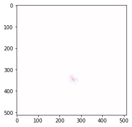
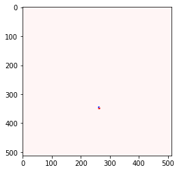
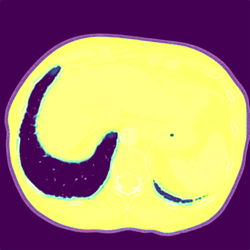
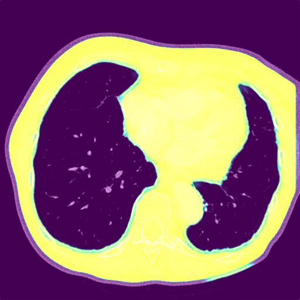
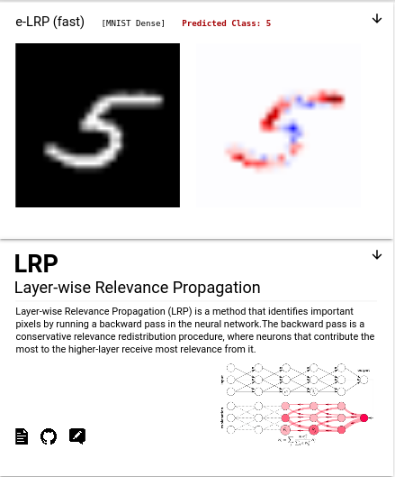
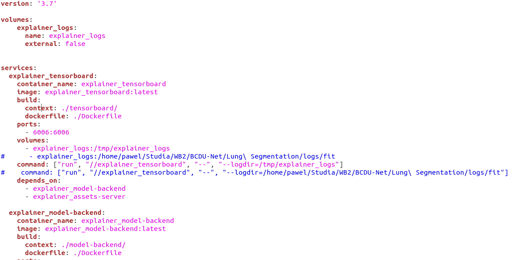

# XAI - Wyjaśnialne uczenie maszynowe

## Biblioteka iNNvestigate

W bibliotece iNNvestigate było dostępnych wiele metod jednak tylko część z nich mogłabyć zastosowana do objaśnienia naszej sieci.

### 1.1 LRPEpsilon
Najciekawsze wyniki, uzyskaliśmy przy pomocy metody LRPEpsilon, jednak jak widać na załączonym wykresie trudne jest wyciągnięcie z tego wniosków co do tego jak przebiega uczenie sieci. Metoda ta przypisuje rekurencyjnie istotność każdemu wejściowemu neuronowi proporcjonalnie do jego wpływu na neuron wyjściowy.

Możemy zauważyć, że z powodu MaxPoolingu za istotne zostały uznane te neurony, które zostały po ostatnim MaxPoolingu, czyli jest ich około 64 x 64. 

### 1.2 DeepTaylor
Kolejną metodą, którą udało się zastosować na naszym modelu jest DeepTaylor. Niestety w przypadku tej metody wyniki były jeszcze mniej zrozumiałe niż w poprzedniej.
Działanie tej metody polega na obliczaniu dla każdego neuronu rootpointu, który jest zbliżony do wejścia, ale którego wartość wyjściowa wynosi 0, następnie ta różnica jest wykorzystywana do rekurencyjnego oszacowania istotności każdego neuronu.

## 2 Skorzystanie z innych frameworków

### 2.1 tf_explain

Zdecydowaliśmy się na skorzystanie z biblioteki [tf_explain](https://github.com/sicara/tf-explain). Udostępnia ona kilka metod XAI, które nie są dostępne w poprzednich frameworkach. Niestety nie wszystkie z nich nadają się do wyjaśniania problemu segmentacji. Do naszego problemu można użyć co najmniej dwóch metod udostępnianych w tym pakiecie.

#### 2.1.1 GradCAM

Pierwszą z nich autorzy nazwali GradCAM. Metoda opiera się na analizie gradientów w warstwach aktywacyjnych. Na danych z naszego modelu prezentuje się to następująco: 

Jak widać model zwraca uwagę na wszystkie tkanki poza wewnątrz ciała człowieka. Ignoruje natomiast obszar poza nim. Większą uwagę poświęca też granicom między płucami a innymi częściami ciała.

#### 2.1.2 Occlusion Sensitivity

Drugą metodą z tego pakietu, którą zastosowaliśmy jest Occlusion Sensitivity. Metoda ta polega na iteracyjnym przesłanianiu poszczególnych części obrazka wejściowego i sprawdzania wpływu tego przesłonięcia na wynik. Dla innego obrazka z naszych danych wyjaśnienie wygląda tak:

Jak widać, wyniki tej metody również wskazują na poprawne działanie modelu.

### 2.2 explAIner

 wraz z  to stworzony w 2020r. framework do wyjaśnialnego i interaktywnego uczenia maszynowego
dedykowany modelom tworzony na podstawie pakietu TensorFlow. Aplikacja jest stworzona na podstawie narzędzia TensorBoard oraz udostępniana przez repyzotorium w kontenerze docker. Wedle idei,
użytkownik korzystający z ExplAInera ma możliwość przeprowadzenia procesu zrozumienia, diagnozy, poprawy oraz raportowania wybranego modelu uczenia predykcyjnego. W aplikacji udostępniono
wiele metod wyjaśnialnej sztucznej inteligencji - m.in. metody gradientowe czy też metody oparte na analizie sygnałów w propagacji między warstwami. Przykładowe wyjaśnienie na podstawie
modelu rozwiązującego problem :

Niestety, dokumentacja narzędzia opisująca możliwość samodzielnego uruchomienia aplikacji jest nad wyraz szczątkowa, szczególnie dla osób nie mających doświadczenia z aplikacjami w dockerze.
Po aplikacji wymaganych pakietów brak informacji w jaki konkretny sposób dodać historię trenowania modelu innego niż proponowanych jako przykłady. Wiele czasu poświęciliśmy na samodzielną
edycję pliku konfiguracyjnego aplikacji celem modyfikacji dostępnych modeli, jednak działania nie zakończyły się powodzeniem.

Bez powodzenia zakończyły się również próby korzystania z wbudowanych funkcji wyjaśniających proces uczenia poza aplikacją. Jedynym sukcesem tych prób okazała się możliwość uruchomienia
bazowej aplikacji TensorBoard z badanym przez nas modelem.

### 2.3 Pozostałe metody XAI

Jako że próby skorzystania z ExplAInera zakończyły się fiaskiem, dokonaliśmy również szeregu prób uruchomienia innych istniejących pakietów do XAI. Niestety wiele z nich miało problemy
z kompatybilnością z drugą wersją TensorFlow bądź wprost wymagały innej wersji pakietu Keras, uniemożliwiającej trenowanie sieci BCDU Net. Poniżej znajduje się lista wypróbowanych pakietów
wraz z krótkim opisem błędu:

-  - brak kompatybilności z Kerasem w wersji wyższej niż 2.1 - wg autorów wina błędu w pakiecie Keras,
-  - brak kompatybilności z TensorFlowem w wersji wyższej niż 2.1 - otwarty  na GitHub,
-  - pakiet wspiera obecnie sieci neuronowe, jednak nie te budowane z pomocą TensorFlow. Autorzy pracują nad rozszerzeniem funkcjonalności
narzędzia. Próby użycia pakietu kończyły się niepowodzeniem na poziomie przekazania obrazów wejściowych do sieci,
-  - pakiet do przeprowadzania ataków na sieć, brak powodzenia ze względu na rozmiar
wyjścia modelu (512, 512, 1),
-  - niejasny, o ile istniejący, sposób obsługiwania modeli sieci neuronowych - wszystkie przykłady oraz dokumentacja opierały się
na przykładach tworzonych z pomocą pakietu scikit-learn.

## 3. Podsumowanie

Pomimo prac nad modelem tworzonym w jednej z najpopularniejszych bibliotek służących do konstruowania sieci neuronowych Keras, istniejące w obecnej chwili narzędzia służące ich wyjaśnianiu często mają problem z kompatybilnością z używanymi wersjami pakietów. Mimo to, udało nam się skorzystać z kilku frameworków oraz przetestować co najmniej 4 różne metody wyjaśnialnego uczenia maszynowego potwierdzające poprawność modelu.

