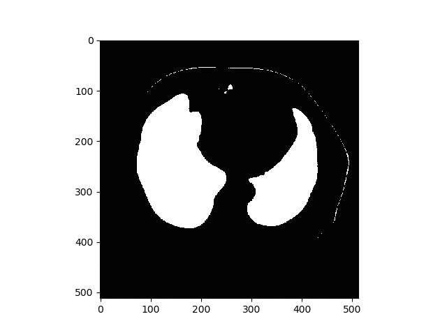
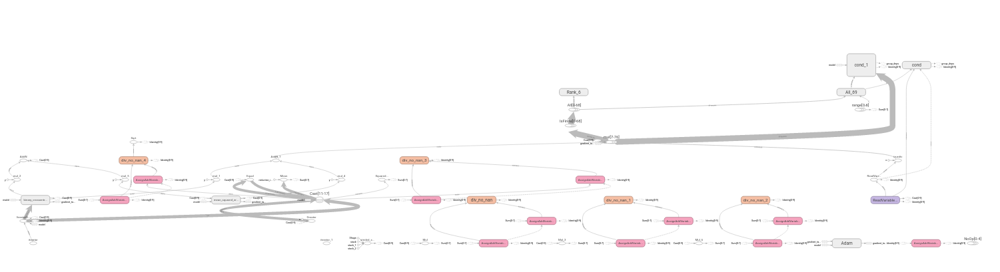
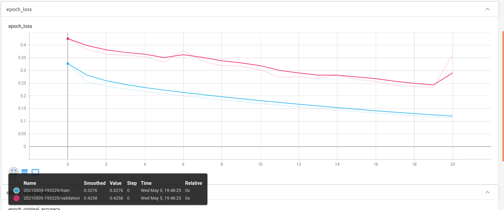
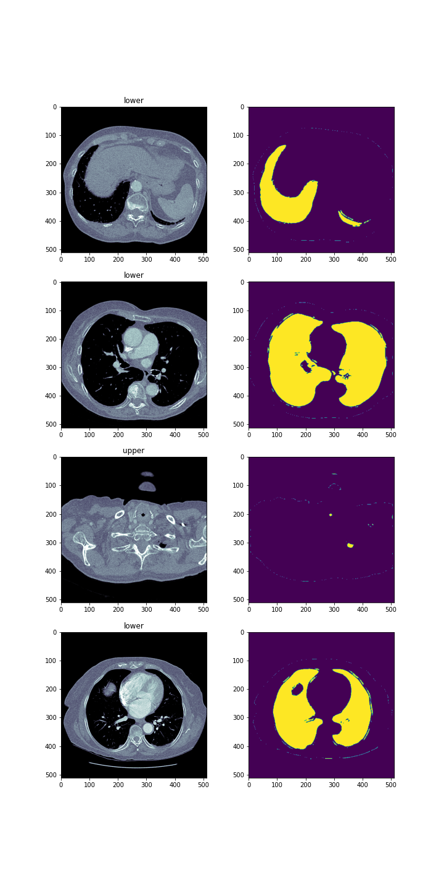

# Praca domowa nr 7 - Zaawansowane techniki

## 1. Monitorowanie uczenia modeli

### 1.2 Wywołania zwrotne - callbacks

Pakiet Keras udostępnia swoim użytkownikom szereg wywołan zwrotnych wykorzystywanych w procesie trenowania modeli. Istnieje możliwość dodania tzw. callbacków uaktywnianych w różnych etapach trenowania - na początku, na końcu, przed lub po epoce bądź przed lub po prezentacji batcha wzorców. Nietrudno także stworzyć personalizowane wywołanie zwrotne. Co ciekawe, twórcy sieci BCDU-Net aktywnie korzystają z wywołań zwrotnych w swoim rozwiązaniu. Są to:
- ModelCheckpoint - wywołanie zapisujące wagi w sieci, w tym przypadku za każdym razem gdy wartość funkcji straty na zbiorze walidacyjnym jest dotychczas najniższa,
- ReduceLROnPlateau - wywołanie służące dynamicznym modyfikacjom współczynnika uczenia, w tym przypadku w momencie gdy wartość funkcji straty nie maleje przez 7 kolejnych epok.

Ze względu na przydatność w procesie trenowania, zdecydowaliśmy się na dodanie kilku nowych wywołań zwrotnych:
- TensorBoard - zapisuje logi istotne w kontekście wizualizacji modelu w narzędziu o tej samej nazwie,
- CSVLogger, który zapisuje wartości funkcji straty oraz metryk na zbiorach treningowych i walidacyjncyh po kolejnych epokach,
- TerminateOnNaN, który kończy uczenie gdy wartość funkcji straty jest niezdefiniowana

oraz własnoręcznie napisane wywołanie zwrotne o nazwie PredictImage, które po każdej kolejnej epoce zapisuje maskę predykowaną przez sieć w bieżącym stanie dla wybranej obserwacji, najlepiej z zbioru testowego. Takie wywołanie zwrotne może generować ciekawe animacji prezentujące poprawę skuteczności modelu w kolejnych iteracjach.

W generowanych w przyszłości grafikach pojawi się informacja na temat epoki, po której powstała dana maska.

### 1.3 Tensorboard

Dzięki skorzystaniu z wywołania zwrotnego TensorBoard istnieje możliwość monitorowania procesu trenowania sieci, zarówno na bieżąco, jak i po fakcie. Aplikacja TensorBoard udostępnia interfejs umożliwiający m.in. śledzenie modyfikacji parametrów sieci, wartości funkcji straty oraz metryk i wyświetlania diagramów reprezentujących sieć. Diagram dla sieci rozwiązującej również zadanie dodatkowe z PD5 prezentuje się następująco:

Dzięki śledzeniu wartości funkcji celu można zidentyfikować kiedy model zaczyna się nadmiernie dopasowywać do danych, tracąc możliwość generalizacji. W poniższym przypadku niepokojąco wygląda wartość funkcji straty na zbiorze walidacyjnym po 20 epokach, która zaczyna rosnąć.

## 2. Model z dwoma wyjściami

W ramach implementacji modelu z dwoma wyjściami postanowiliśmy, że drugie wyjście będzie dotyczyło klasyfikacji zdjęć w zależności od ich lokalizacji w ciele człowieka.

### 2.1 Zadanie klasyfikacji

Zdjęcia są przydzielane do dwóch klas `upper` lub `lower` w zależności od tego na jakiej wysokości w ciele człowieka dany przekrój się znajduje. Taki podział mógłby pomóc w rozpoznawianiu z którego obszaru pochodzi przekrój segmentowanych płuc.
Poniżej przedstawiamy, obrazek pomocniczy według którego dokonywalismy podziału. Przy podziale pomogła również koleżanka studiująca medycynę.

### 2.2 Architektura

Nowo utworzona sieć składa się z dwóch gałęzi. Pierwszą gałęzią jest sieć BCDUNet, z kolei drugą gałęzią odpowiedzialną za klasyfikację zdjęć jest sieć [ResNet](https://github.com/raghakot/keras-resnet). Została ona nieznacznie zmodyfikowana tak aby mogłabyć stosowana w dwuwyjściowym modelu. 
Tak przygotowany model uczył się około dwa razy dłużej niż model z jednym wyjściem, dlatego ograniczyliśmy się do dwóch epok. 

### 2.3 Wyniki

Pomimo niewielkiej liczby epok=2 wyniki modelu są zadowalające. 

Poniżej widać zdjęcia z maskami oraz z przydzielonymi im etykietami.

**Wyniki dla klasyfikacji**
| Accuracy        | Sensitivity           | Precision  | F1 Score |
| ------------- |-------------| -----|-------------|
| 0.9221     | 0.6066 | 1 | 0.7551 |

## 3. Ensamble

Ponieważ autorzy artykułu dostarczyli dwa modele (co prawda bardzo podobne do siebie pod względem architektury), to właśnie ich użyliśmy do ensamblingu. Nasze zadanie dotyczy segmentacji, więc jako funkcję je łączącą zastosowaliśmy średnią. Bierzemy prawdopodobieństwo należenia danego piksela do maski w obu modelach, a jako wynik modelu złożonego, zwracamy średnią tych prawdopodobieństw. Funkcja implementująca ten model znajduje się w pliku [./code/models_with_ensamble.py](./code/models_with_ensamble.py). Niestety nie zdążyliśmy nauczyć sieci skonstruowanej w ten sposób, więc nie możemy jeszcze powiedzieć, czy wyniki się poprawiły.
